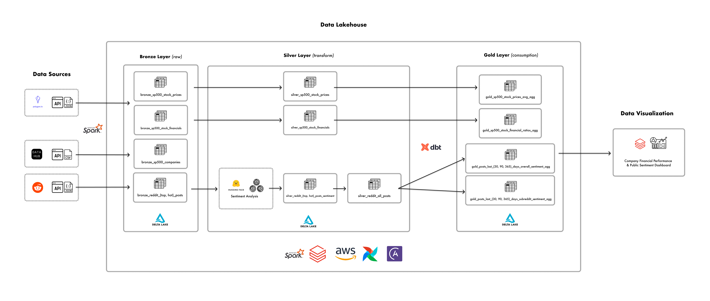
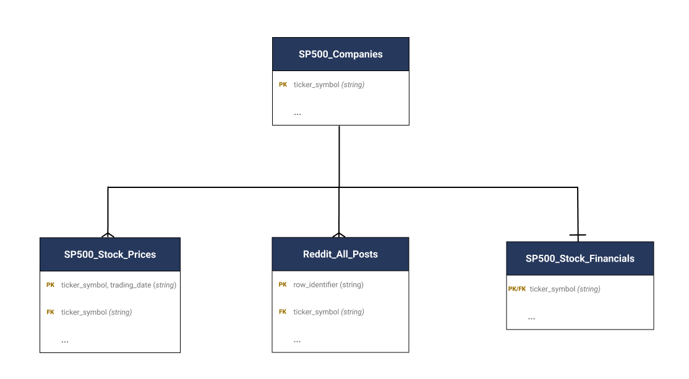
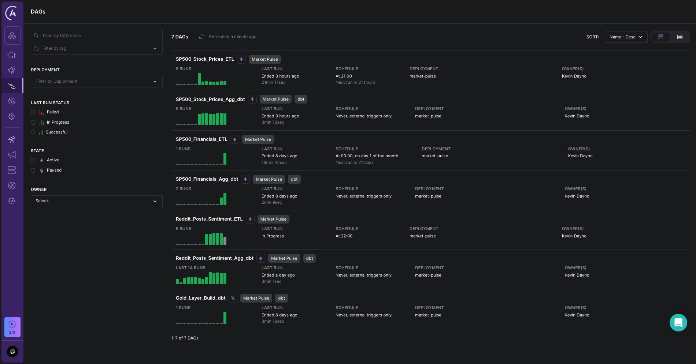
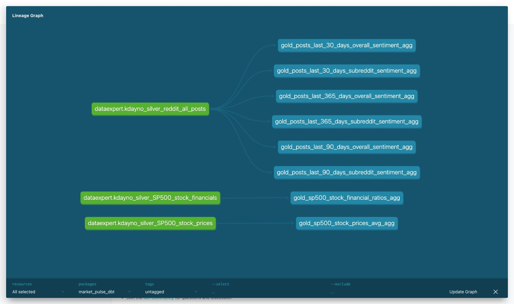

**Table of Contents**


<br>

# 1. Overview
## 1.1. Problem Statement 
The average retail investor interested in stock market investing often faces an overwhelming amount of information, making it challenging to gain quick, actionable insights into a company's stock performance and public sentiment. This information overload can lead to decision paralysis or uninformed investment choices. 

## 1.2. Purpose
The Market Pulse dashboard addresses this issue by providing a streamlined, user-friendly interface that offers immediate insight into a company's stock performance and public sentiment from online forums such as Reddit. This enables investors by providing them with a general sense of a company's performance relative to their industry and a guide to focus their more in-depth research.

## 1.3. End User
The average retail investor who is interested in stock investing and is beginning
to gather information about a prospective company they may want to invest in.

## 1.4. Data Sources
- [DataHub.io API](https://datahub.io/core/s-and-p-500-companies)
- [Polygon.io API](https://polygon.io/docs/rest/stocks/overview)
- [Reddit API](https://www.reddit.com/dev/api/oauth)

<br>

# 2. Design & Development

## 2.1. Solution Architecture


## 2.2. Tech Stack
- **Storage:** AWS S3, Delta Lake, Parquet
- **Data Processing:** Databricks, Hugging Face, Apache Spark, dbt Core
- **Data Visualization:** Databricks Dashboards
- **Orchestration:** Astronomer/Airflow
- **DevOps:** GitHub, GitHub Actions

## 2.3. Conceptual Data Model


## 2.4. Dashboard
https://github.com/user-attachments/assets/1f82142e-505e-46d8-9a7a-5b431d633d1a


## 2.5. Astronomer Orchestration


## 2.6. dbt Gold Layer Lineage


<br>

# 3. Challenges
1. **API Rate Limits:** The Reddit API has a rate limit of 100 queries per minute (QPM) per OAuth client ID for
their Free tier leading to the need to introduce defined wait periods to avoid reaching the rate limit
2. **Infrastructure Integrations:** When integrating Databricks with Astronomer and dbt, there were some difficulties because the Databricks instance was managed externally by the data bootcamp leading to additional research and prototyping being required to ensure proper connectivity.
3. **Data Visualization Limitations:** Using Databricks Dashboards was a simple and appealing choice for building the dashboard since it is integrated very well with the Databricks platfrom, but due to the limited data visual options this made it diffcult to present the data, particularly the sentiment analysis data, in a compelling way. For example, it would have been more impactful if it was possible to display the sentiment data on the same visual as the stock price data to observe that relationship more closely and easily.

<br>

# 4. Future Enhancements
1. **Additional Data Souces:** Integrate source data from addtional social media networks (e.g. Twitter, Blue Sky, etc.) for a more comprehensive and less biased sentiment analysis
2. **Additional Reddit Data:** Add posts data from additional stock/investing related subreddits. Currently, data was scraped from four of the top stock/investing subreddits but this could be expanded to the top ten stock/investing subreddits for better
3. **Alternative Data Visualization Application:** To improve the data visualization component of the solution,  a more comprehensive and fully-featured application could be considered such as Apache Superset or Tableau. This would offer more compelling visuals to choose from leading to more value being extracted from the data and a better user experience.

<br>

# 5. Project Structure
```
market-pulse
│ 
├── .github
│   └── workflows     -> GitHub Actions
├── astro             -> Astronomer project
│   ├── Dockerfile    -> The Astronomer Dockerfile for development and deployment
│   └── dags          -> Directed Acyclic Graphs (DAGs) for Extract-Transform-Load (ETL) scripts
├── dashboard         -> Databricks Dashboard 
├── docs              
│   └── images        -> Images for README
├── etl
│   ├── ddls          -> Table definitions for all data lakehouse tables
│   ├── extract       -> Scripts to extract data from source systems
│   ├── load          -> Scripts to load transformed data into the data lakehouse
│   ├── tests         -> Scripts for testing data quality
│   ├── transform     -> Scripts to transform data within the data lakehouse
│   └── utils         -> Utility scripts used across the entire ETL process
├── market_pulse_dbt  -> dbt project
│   ├── macros        -> dbt macros
│   ├── models
│   │   └── gold      -> dbt models for gold layer
│   └── tests        
        └── generic   -> Custom generic tests
├── LICENSE.md
├── README.md
└── requirements.txt
```

<br>

# 6. References
- [Airflow+Databricks DAGs Docs](https://airflow.apache.org/docs/apache-airflow-providers-databricks/stable/index.html)
- [Astronomer Cross-DAG Dependencies](https://www.astronomer.io/docs/learn/cross-dag-dependencies/?tab=taskflow#triggerdagrunoperator)
- [Astronomer+Databricks Setup and Development Docs](https://www.astronomer.io/docs/learn/airflow-databricks/)
- [Astronomer+dbt Setup and Development Docs](https://astronomer.github.io/astronomer-cosmos/)
- [dbt Databricks configurations](https://docs.getdbt.com/reference/resource-configs/databricks-configs)
- [Hugging Face FinBERT: Pre-trained NLP model to analyze sentiment of financial text created by ProsusAI](https://huggingface.co/ProsusAI/finbert)
