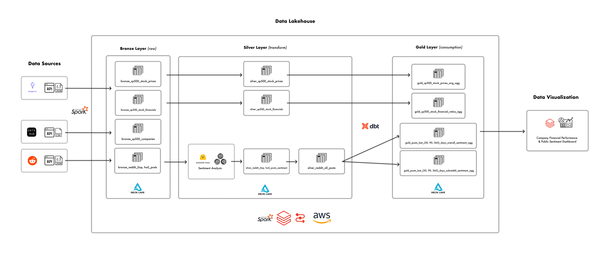

## Problem Statement
The average retail investor interested in stock market investing often faces an overwhelming amount of information, making it challenging to gain quick, actionable insights into a company's stock performance and public sentiment. This information overload can lead to decision paralysis or uninformed investment choices. 

## Purpose
The Market Pulse dashboard addresses this issue by providing a streamlined, user-friendly interface that offers immediate insight into a company's stock performance and public sentiment from online forums such as Reddit. This enables investors by providing them with a general sense of a company's performance relative to their industry and a guide to focus their more in-depth research.

## End User
The average retail investor who is interested in stock investing and is beginning
to gather information about a prospective company they may want to invest in.

## Data Sources
- DataHub.io API
- Polygon.io API
- Reddit API

# Design

## Solution Architecture

## Tech Stack
- **Storage:** AWS S3, Delta Lake, Parquet
- **Processing:** Databricks, Hugging Face, Apache Spark, dbt
- **Orchestration:** Astronomer/Airflow
- **DevOps:** GitHub, GitHub Actions
- **Data Visualization:** Apache Superset

## Conceptual Data Model

# Challenges
- The Reddit API has a rate limit of 100 queries per minute (QPM) per OAuth client ID for
their Free tier which caused issues with extracting Reddit posts data

# Future Enhancements
1. Source data from addtional social media networks (e.g. Twitter, Blue Sky, etc.) for more comprehensive sentiment analysis
2. Add posts data from additional stock/investing related subreddits
